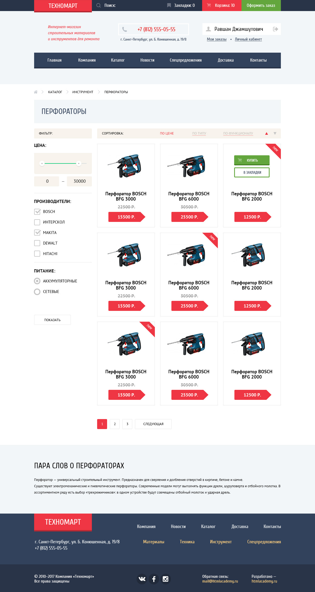

# Учебный проект «Техномарт»

* <b>Верстка:</b> [Иван Псарёв](https://github.com/PsarewIvan).
* <b>Дизайн:</b> [HTML Academy](https://htmlacademy.ru).
* <b>Используемые библиотеки:</b> [noUIslider](https://refreshless.com/nouislider/).

* <b>Ссылка на страницу:</b> [Главная](https://psarewivan.github.io/Technomart/index.html)

---

### Используемые технологии

* HTML5, CSS3
* Vanilla JS
* noUIslider (Vanilla JS библиотека)
* API ЯндексКарты
* Кроссбраузерность: Chrome, Firefox, Opera, Safari (IE слабая поддержка из-за использования Grid Layout)
* БЭМ
* svg
* Flexbox сетка

#### Описание макета:

##### Все макеты

Сайт статичный, полностью доступный с клавиатуры. Контентная область центрируется и составляет 960px.

Авторизованному и неавторизованному посетителю показывается разный вид
блока авторизации (при нажатии кнопки <b><i>"Войти"</i></b>).

При клике на кнопку <b><i>«Купить»</i></b> возникает модальное окно с сообщением о добавлении товара в корзину

##### [Главная](https://psarewivan.github.io/Technomart/index.html)

Слайдер "Промо-блока" и блока "Сервисы" на чистом JS. Поддерживает любое количество слайдов.

Кнопка: <b><i>«Открыть каталог»</i></b> в слайдере "Промо-блока" - это ссылка, которая ведет на
внутреннюю страницу: [Каталог](https://psarewivan.github.io/Technomart/catalog.html)

Блок карты — обычное изображение, клик по ней открывает модальное окно с Яндекс картами.

Кнопка <b><i>"Заблудились? Напишите нам!"</i></b>, под блоком карты, открывает модальное окно с формой обратной связи. При отключенном JS, происходит переход на отдельную страницу с [формой обратной связи](https://psarewivan.github.io/Technomart/form.html).

##### [Каталог](https://psarewivan.github.io/Technomart/catalog.html)

Слайдер выбора диапазона цены реализован с помощью [noUIslider](https://refreshless.com/nouislider/). Слайдер доступен с клавиатуры, можно вводить числовые значения в поле вывода.

Форму можно отправить кнопкой "Показать" для проверки введенных данных.

#### Preview

